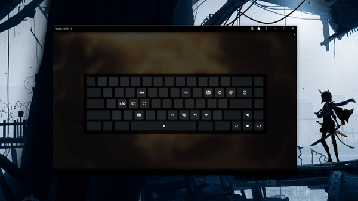

<h1 align="center">
	Svelte Keybinds
</h1>
<p align="center">
  <br>
</p>

## Functions:
```jsx
import Keybinds, { binds, loadWithDefaults, condition } from './Keybinds.svelte'

<Keybinds let:prop={item} autosave={true} clickable={true}>
```
- `clickable` - runs functions when the user clicks the key in the UI
- `condition` - async callback function any time a keybind is ran, if it returns true the keybind is ran, if it returns false it isnt
- `binds` - store/writable, binds object
- `autosave` - automatically saves to localstorage when a user changes binds, requires `id` in binds object
- `loadWithDefaults(defaults)` - loads the stored keybinds from autosave, using specific defaults, if a new keybind was added it will be properly created


## Usage:

Simple example:
```html
<script>
	import Keybinds, { binds } from './Keybinds.svelte';

	$binds = {
		ArrowRight: {
			fn: console.log,
			label: '+2',
		},
		ArrowLeft: {
			fn: console.warn,
			label: '-2',
		},
		KeyA: {
			fn: console.error,
			label: '1'
		}
	};
</script>

<Keybinds let:prop={item}>
	<div class="font-size-24 flex-center">{item?.label || ''}</div>
</Keybinds>

<style>
	.font-size-24 {
		font-size: 24px;
	}
	.flex-center {
		display: flex;
		height: 100%;
		justify-content: center;
		align-items: center;
	}
</style>
```

Example with autosave:
```html
<script>
	import Keybinds, { binds, loadWithDefaults } from './Keybinds.svelte';

	const defaults = {
		ArrowRight: {
			fn: console.log,
			id: '+2',
		},
		ArrowLeft: {
			fn: console.warn,
			id: '-2',
		},
		KeyA: {
			fn: console.error,
			id: '1'
		}
	};

	$: console.log($binds)

	loadWithDefaults(defaults)
</script>

<Keybinds let:prop={item} autosave={true} clickable={true}>
	<div class="font-size-24 flex-center">{item?.id || ''}</div>
</Keybinds>

<style>
	.font-size-24 {
		font-size: 24px;
	}
	.flex-center {
		display: flex;
		height: 100%;
		justify-content: center;
		align-items: center;
	}
</style>

```